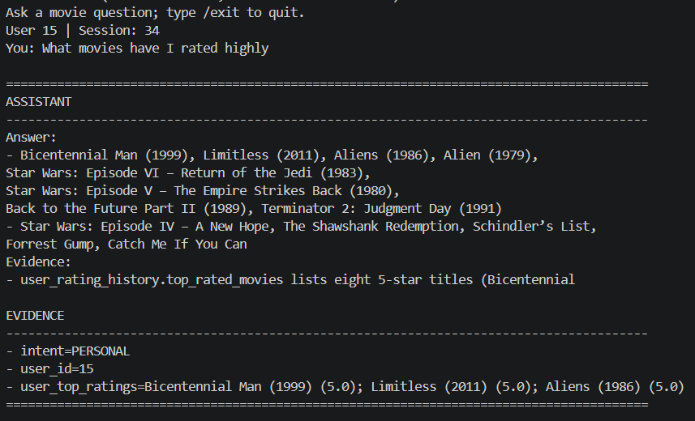
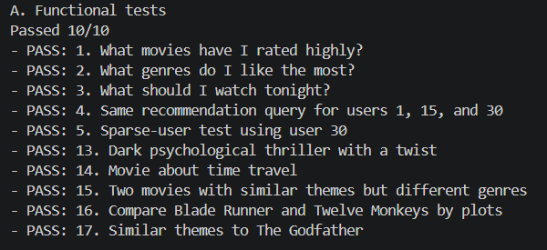
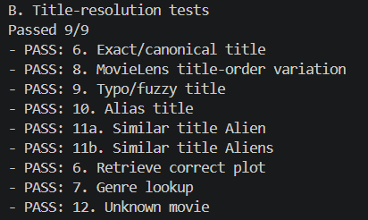
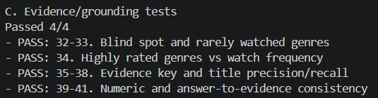
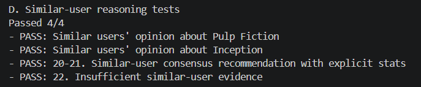
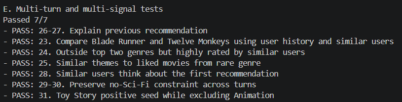
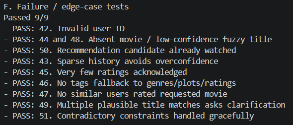
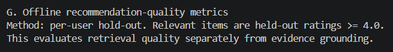
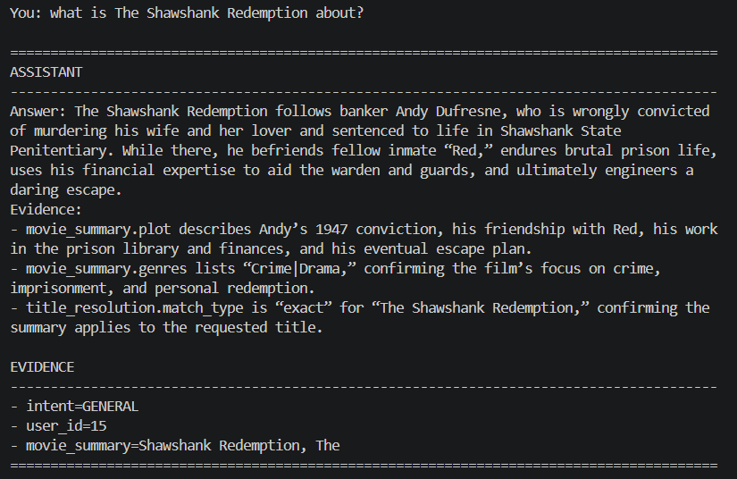
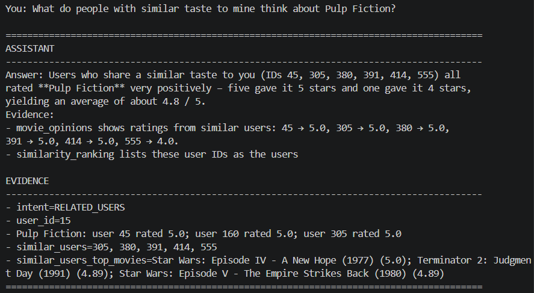

# TrustedAI Movie Discovery Assistant

[](https://www.python.org/)
[](https://www.langchain.com/langgraph)
[](https://www.langchain.com/)
[](https://console.groq.com/)
[](#evaluation)

An evidence-grounded movie discovery assistant built on a filtered MovieLens dataset. The assistant retrieves factual evidence from local data first, then uses an LLM to synthesize that evidence into concise answers. Ratings, similarities, title matches, and recommendation evidence are computed by deterministic Python tools, not invented by the model.

## Table of Contents

- [Features](#features)
- [Project Structure](#project-structure)
- [Dataset](#dataset)
- [Installation](#installation)
- [Groq API Key](#groq-api-key)
- [Run the Assistant](#run-the-assistant)
- [Run Tests](#run-tests)
- [Evaluation](#evaluation)
- [Example Workflows](#example-workflows)
- [Troubleshooting](#troubleshooting)

## Features

- Personalized answers from user rating history, genre preferences, and watched-movie filtering.
- Movie title resolution for exact names, aliases, typos, MovieLens title-order variants, and unknown titles.
- TF-IDF content retrieval over movie titles, genres, and plot summaries.
- Similar-user reasoning with precomputed user similarity and rating aggregation.
- Multi-turn memory through LangGraph checkpointing.
- Evidence-first response generation with no-fabrication constraints.
- Offline evaluation covering functional behavior, grounding, similar-user logic, multi-signal reasoning, edge cases, and ranking diagnostics.

## Project Structure

```text
cine-reason-assistant/
|-- app/
|   |-- main.py                         # CLI entry point
|   |-- config.py                       # Loads .env and GROQ_API_KEY
|   |-- agent/
|   |   |-- graph.py                    # LangGraph workflow and memory
|   |   |-- router/                     # Intent classification
|   |   |-- nodes/                      # General, personal, and related-user nodes
|   |   |-- llm/                        # Groq LLM client and prompts
|   |   `-- tools/                      # Dataset evidence tools
|   `-- data/
|       |-- ml-latest-small-filtered/   # Filtered MovieLens CSV files
|       `-- clean-data/                 # Precomputed profiles and similar users
|-- scripts/
|   |-- trustedai_evaluation_suite.py   # Main offline evaluation suite
|   |-- evaluate_evidence_quality.py    # Quantitative evidence checks
|   `-- verify_dataset.py               # Dataset verification helper
|-- tests/                              # Pytest tests
|-- images/                             # Evaluation screenshots and examples
|-- Reports/REPORT.md                   # Additional report notes
|-- requirements.txt
`-- README.md
```

## Dataset

The project expects the dataset under:

```text
app/data/ml-latest-small-filtered/
```

Required files:

- `movies.csv`: movie IDs, titles, and genres.
- `movies_with_plots.csv`: movie metadata with plot summaries.
- `ratings.csv`: explicit user ratings.
- `tags.csv`: user-provided movie tags.
- `links.csv`: external movie identifiers.

Precomputed files:

- `app/data/clean-data/user_profiles.parquet`
- `app/data/clean-data/user_similarity.parquet`

The main join keys are `movieId` for movie data and `userId` for user data.

## Installation

### 1. Open the Project

```powershell
cd D:\Subject\HOME_TEST\cine-reason-assistant
```

### 2. Create a Virtual Environment

```powershell
python -m venv .venv
```

### 3. Activate the Environment

PowerShell:

```powershell
.\.venv\Scripts\Activate.ps1
```

Command Prompt:

```cmd
.venv\Scripts\activate.bat
```

macOS/Linux:

```bash
source .venv/bin/activate
```

### 4. Upgrade pip

```powershell
python -m pip install --upgrade pip
```

### 5. Install Dependencies

```powershell
python -m pip install -r requirements.txt
```

## Groq API Key

The interactive assistant uses Groq for LLM inference through `langchain-groq`. You must create a Groq API key before running the chat app.

1. Go to [https://console.groq.com/](https://console.groq.com/).
2. Sign in or create an account.
3. Open the API Keys section.
4. Create a new API key.
5. Create a `.env` file in the project root.

Example `.env`:

```env
GROQ_API_KEY=your_groq_api_key_here
```

The key is loaded in `app/config.py`. If it is missing, the app stops with:

```text
GROQ_API_KEY not found in .env
```

## Run the Assistant

Start the CLI assistant:

```powershell
python -m app.main
```

You will be asked for:

- `User ID`: a MovieLens user ID, for example `1`, `15`, or `30`.
- `Session name`: press Enter for `default`, or reuse a previous session name to continue memory.

Example questions:

```text
What movies have I rated highly?
What genres do I like the most?
What should I watch tonight?
What do similar users think about Pulp Fiction?
Recommend something like Toy Story but not Animation.
Tell me about The Shawshnk Redemption.
```

Exit the chat with:

```text
/exit
```



## Manual Test Prompts

To manually test the assistant:

1. Enter any valid `User ID`. User `15` is recommended because it has enough rating history for personalization and similar-user reasoning.
2. Enter any `Session name`. The session name is used to save and reuse the agent's conversation memory. You can type any name, for example `demo`, `test`, or press Enter to use `default`.
3. Ask any movie-discovery question. The prompts below are good examples for checking personalization, constraints, similar-user evidence, content search, and multi-turn memory.

### 1. Personalization

```text
What are my favorite movie genres based on my rating history?
```

```text
What kind of movies do I seem to like the most?
```

### 2. Recommendation

```text
What should I watch tonight? Recommend 5 movies based on my rating history.
```

```text
Recommend 3 movies I haven't watched that match my taste, and explain why.
```

### 3. Recommendation with Constraints

```text
I like sci-fi, but I don't want to watch sci-fi tonight. What should I watch instead?
```

```text
Recommend something outside my top two genres that I might still enjoy.
```

### 4. Similar Users

These prompts are useful for checking whether the assistant grounds numbers in retrieved evidence instead of fabricating statistics.

```text
What do people with similar taste to mine think about Pulp Fiction?
```

```text
How many users similar to me rated Pulp Fiction, and what was their average rating?
```

### 5. Content + Personalization

```text
I want a dark thriller with a twist. What would you recommend based on my taste?
```

```text
Find me a movie with themes similar to Alien that I haven't watched.
```

### 6. Multi-turn Recommendation Explanation

Ask this first:

```text
Recommend 3 movies for me.
```

Then ask a follow-up in the same session:

```text
Why did you recommend the first one?
```

## Run Tests

Run the pytest suite:

```powershell
pytest
```

Run selected test files:

```powershell
pytest tests\test_agent_memory.py
pytest tests\test_irrelevant_question_guard.py
```

## Evaluation

Run the main TrustedAI offline evaluation suite:

```powershell
python scripts\trustedai_evaluation_suite.py
```

This suite does not call the LLM. It checks deterministic evidence retrieval and recommendation behavior directly against the local dataset.

Expected evidence/functional summary:

```text
A. Functional tests: Passed 10/10
B. Title-resolution tests: Passed 9/9
C. Evidence/grounding tests: Passed 4/4
D. Similar-user reasoning tests: Passed 4/4
E. Multi-turn and multi-signal tests: Passed 7/7
F. Failure / edge-case tests: Passed 9/9
Overall evidence/functional checks: Passed 43/43
```

### Evaluation Output Screenshots

The images below correspond to the printed groups from `scripts/trustedai_evaluation_suite.py`.

#### A. Functional tests

Checks user rating history, genre preference, personalized recommendations, user-specific outputs, sparse-user behavior, and content/theme search.



#### B. Title-resolution tests

Checks exact titles, MovieLens title-order variants, typo/fuzzy matching, aliases, similar titles such as `Alien` and `Aliens`, plot lookup, genre lookup, and unknown movies.



#### C. Evidence/grounding tests

Checks blind spots, rarely watched genres, high-rated versus frequently watched genre evidence, required evidence keys, title precision/recall, and answer-to-evidence consistency.



#### D. Similar-user reasoning tests

Checks similar-user opinions about target movies, rating counts, average ratings, consensus recommendation evidence, and insufficient-evidence behavior.



#### E. Multi-turn and multi-signal tests

Checks previous recommendation explanation, user-history plus similar-user evidence, outside-top-genre recommendation, rare-genre discovery, constraint preservation, and positive seed handling.



#### F. Failure / edge-case tests

Checks invalid user IDs, absent movies, low-confidence fuzzy titles, watched-candidate exclusion, sparse history, few-rating uncertainty, missing tags, ambiguous title matches, and contradictory constraints.



#### G. Offline recommendation-quality metrics

Shows the separate hold-out ranking diagnostic. This section is used to discuss ranking-quality limitations separately from the `43/43` evidence/functional checks.



### What Each Evaluation Function Checks

- `evaluate_functional()`: retrieves top-rated movies for the current user, derives genre preferences, generates unwatched recommendations, checks personalization across users, and handles sparse profiles.
- `evaluate_content_search()`: finds movies from theme queries, compares movie plots, and retrieves movies similar to a seed title.
- `evaluate_title_resolution()`: resolves exact, canonical, alias, fuzzy, and unknown titles before plot or genre lookup.
- `evaluate_blind_spots_and_grounding()`: verifies genre exposure evidence, high-rated versus watched counts, required evidence keys, and no-fabrication prompt constraints.
- `evaluate_similar_users()`: retrieves similar users, gathers their ratings for target movies, computes count and average rating, and avoids invented consensus.
- `evaluate_multi_signal_and_memory()`: combines previous recommendations, user history, similar users, content similarity, rare genres, and explicit constraints across turns.
- `evaluate_edge_cases()`: checks controlled behavior for invalid IDs, absent data, ambiguous titles, sparse evidence, missing tags, and contradictory filters.
- `evaluate_offline_metrics()`: runs a separate recommendation-ranking diagnostic using held-out positive ratings.

## Example Workflows

### Personalized Recommendation

The assistant retrieves the current user's profile, rating history, preferred genres, already-watched movies, and candidate recommendations. Watched movies are filtered out before the final answer is generated.



### Similar-User Reasoning

For questions such as "What do similar users think about Pulp Fiction?", the system retrieves similar users, resolves the target title, gathers their ratings, and reports aggregate evidence such as rating count and average rating.



### Grounded Failure Handling

If a movie is missing from the dataset or a title match is low-confidence, the assistant should not fabricate plot, genre, or rating evidence. It returns a conservative answer based on available data.

## Troubleshooting

### `GROQ_API_KEY not found`

Create a `.env` file in the project root:

```env
GROQ_API_KEY=your_groq_api_key_here
```

Get your key from [https://console.groq.com/](https://console.groq.com/).

### PowerShell Cannot Activate the Virtual Environment

If PowerShell blocks activation, run:

```powershell
Set-ExecutionPolicy -Scope Process -ExecutionPolicy Bypass
.\.venv\Scripts\Activate.ps1
```

### Missing Dataset Files

Check that these files exist:

```text
app/data/ml-latest-small-filtered/movies.csv
app/data/ml-latest-small-filtered/movies_with_plots.csv
app/data/ml-latest-small-filtered/ratings.csv
app/data/ml-latest-small-filtered/tags.csv
app/data/clean-data/user_profiles.parquet
app/data/clean-data/user_similarity.parquet
```

### Evaluation Works but Chat Fails

The evaluation suite is mostly deterministic and can run without LLM calls. The chat assistant requires `GROQ_API_KEY` because it uses Groq to synthesize final responses.

## Notes

The system is strongest at grounded evidence retrieval and explanation. The recommendation ranker is intentionally simple and explainable; it is not yet a high-performance trained ranking model. Future improvements should focus on a stronger hybrid recommender while preserving evidence-grounded answers.
