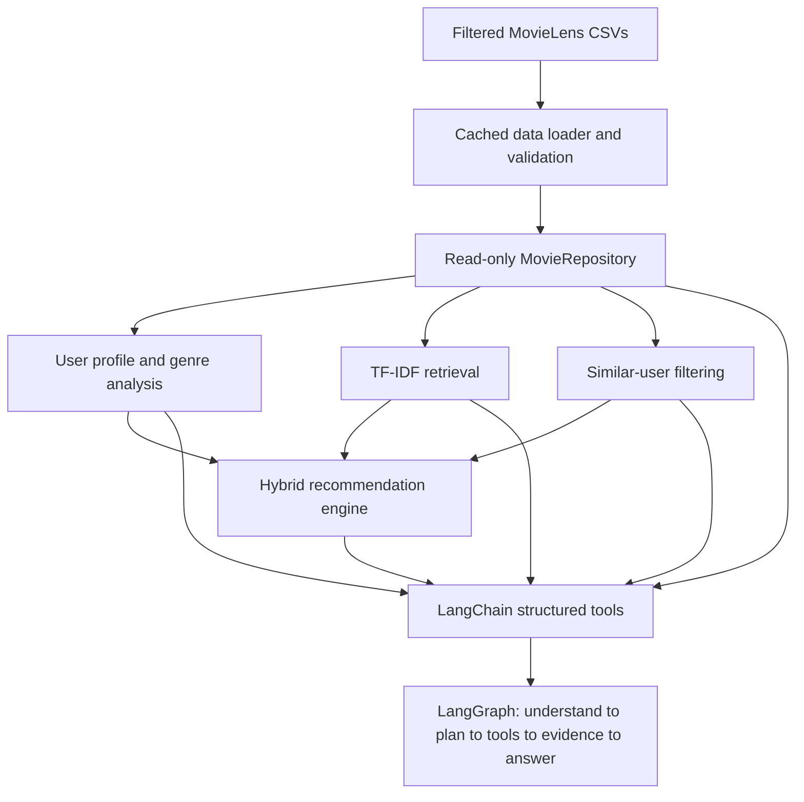

# Movie Discovery Assistant

An evidence-based movie discovery backend built on the filtered MovieLens Small dataset. It combines user-rating analysis, TF-IDF content retrieval, user-user collaborative filtering, and an explainable hybrid ranker. A LangGraph workflow routes natural-language requests to deterministic LangChain tools; it does not let an LLM calculate ratings, similarities, or recommendations.

## Dataset

The local dataset is in `backend/data/ml-latest-small-filtered/`:

- `movies_with_plots.csv`: movie ID, title, year, genres, and plot.
- `movies.csv`, `links.csv`: additional metadata and external IDs.
- `ratings.csv`: explicit MovieLens ratings; there is no `users.csv`.
- `tags.csv`: user-provided movie tags.

`movieId` joins movie metadata, ratings, tags, and links. `userId` joins ratings and tags.

## Architecture



## Main capabilities

- Validated and cached CSV access through `MovieRepository`.
- User profile, rating history, genre averages, favorite/weak genres, and unrated genres.
- TF-IDF movie search and content-based similar movies using title, genres, plots, and tags.
- Similar users with centered cosine-style similarity, overlap count, and aggregated movie opinion.
- Hybrid unseen-movie recommendations with collaborative, content, genre, and quality evidence.
- Grounded LangGraph responses that report unavailable dataset data rather than inventing facts.
- Leakage-aware temporal offline evaluation from explicit ratings.

## Recommendation approach

The hybrid ranker is deterministic:

```text
final_score = 0.40 * collaborative
            + 0.30 * content
            + 0.20 * genre_preference
            + 0.10 * quality
```

Collaborative similarity requires at least two co-rated movies and is shrunk by overlap. Candidate collaborative predictions are further shrunk when neighbor evidence is sparse. Evidence includes component scores, a related high-rated movie when available, and a similar-user predicted rating.

## Tech stack

- Python 3.11+
- scikit-learn: TF-IDF and cosine similarity
- LangChain: typed, structured tools
- LangGraph: bounded state-machine workflow
- Standard-library CSV/dataclass data layer

## Setup

```powershell
python -m venv .venv
.\.venv\Scripts\Activate.ps1
python -m pip install -r requirements.txt
```

The dataset must remain under `backend/data/ml-latest-small-filtered/`.

## Run

Validate the dataset:

```powershell
python scripts\validate_data.py
```

Run five representative grounded conversations:

```powershell
python scripts\demo_final.py
```

The demo covers recommendation, explanation, similar-user opinion, negative genre constraint, and profile coverage. It uses User 1 and the local dataset; no external model/API key is required for this deterministic graph implementation.

## Evaluation

Run all eligible users:

```powershell
python -u scripts\evaluate_recommendations.py
```

For a fast deterministic sample:

```powershell
python -u scripts\evaluate_recommendations.py --max-users 20
```

Evaluation sorts each eligible user's ratings by timestamp, uses older ratings for train, and holds out up to five recent ratings (maximum 20%) for test. The recommendation engine is built from train ratings only. A held-out rating of at least `4.0` is treated as relevant for evaluation; this is a definition based on explicit ratings, not an original binary label. Reported metrics are Precision@5/@10, Recall@5/@10, and NDCG@5/@10.

Current limitations include cold-start users, sparse overlap, lexical TF-IDF behavior, popularity bias, and weak temporal top-K performance on the sampled evaluation split. See [REPORT.md](Reports/REPORT.md) for details.
